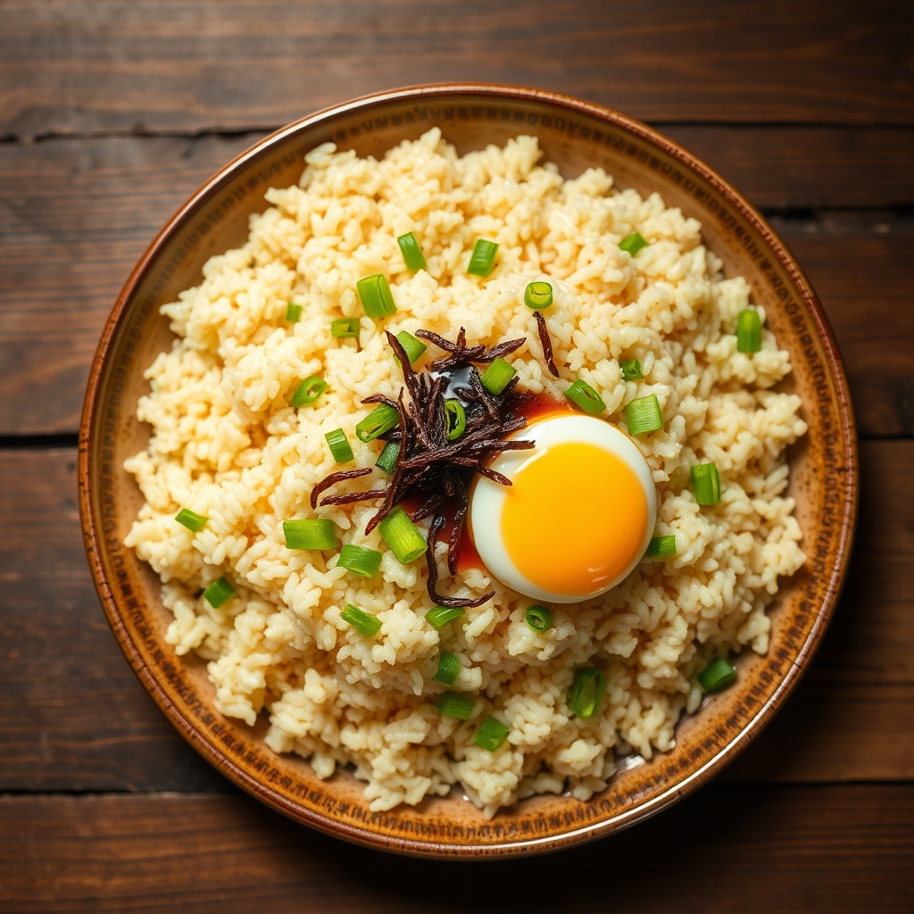

# 고슬고슬 계란볶음밥

> ⏱️ 조리시간: 10분 | 🍽️ 1인분 | 난이도: ⭐ 쉬움

냉장고에 계란이랑 찬밥만 있으면 끝! 프라이팬 하나로 후딱 만드는 국민 야식 겸 저녁이에요. 진짜 쉬워요!

## 📝 재료
- 밥 — 1공기 (찬밥이면 더 좋아요)
- 계란 — 2개
- 대파 — 1/4대 (없으면 생략 가능)
- 간장 — 1큰술
- 굴소스 — 1/2큰술 (없으면 간장 1/2큰술로 대체)
- 식용유 — 1큰술
- 참기름 — 1/2작은술
- 소금·후추 — 약간

## 👨‍🍳 만드는 법
1. 대파는 잘게 송송 썰어요. (파 싫으면 건너뛰어도 돼요!)
2. 달군 팬에 식용유를 두르고 대파를 넣어 30초쯤 볶아 파기름을 내요.
3. 계란 2개를 팬에 바로 깨 넣고 젓가락으로 휘휘 저어 스크램블 해요.
4. 계란이 반쯤 익으면 밥을 넣고 주걱으로 눌러 펴가며 볶아요.
5. 간장·굴소스를 팬 가장자리에 둘러 넣고 (불맛!) 밥알이 고슬고슬해질 때까지 2~3분 볶아요.
6. 소금·후추로 간을 맞추고, 불을 끈 뒤 참기름 살짝 둘러 마무리해요.

## 💡 꿀팁
- **설거지 최소화**: 계란을 따로 부치지 말고 팬 안에서 바로 스크램블하면 그릇 하나 안 써요. 접시 대신 볶은 팬째로 먹으면 설거지 끝!
- **불맛 내기**: 간장은 밥이 아니라 뜨거운 팬 가장자리에 둘러야 살짝 타면서 불맛이 나요.
- **재료 대체**: 대파 대신 양파·쪽파, 굴소스 대신 간장, 밥 위에 김가루나 치즈 한 장 올리면 더 맛있어요.
