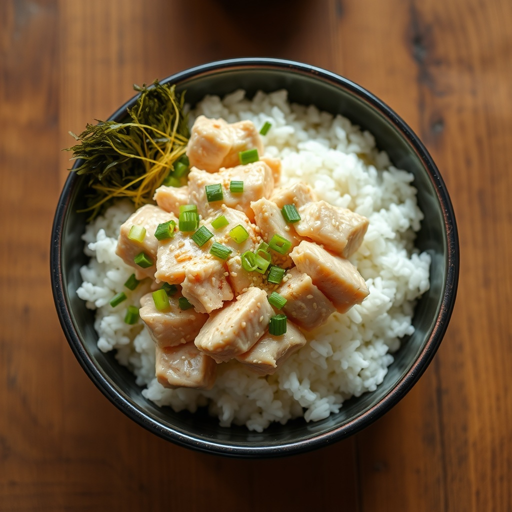

# 참치마요 덮밥

> ⏱️ 조리시간: 8분 | 🍽️ 1인분 | 난이도: ⭐ 쉬움

참치캔 하나로 뚝딱 완성하는 한 그릇 저녁이에요. 그릇 하나랑 숟가락만 있으면 되니까 설거지도 거의 안 나와요!

## 📝 재료
- 참치캔 — 1개 (85~100g)
- 따뜻한 밥 — 1공기 (즉석밥이면 더 편해요)
- 마요네즈 — 1.5큰술
- 간장 — 1작은술
- 설탕 — 약간 (한 꼬집)
- 참기름 — 1작은술
- 김가루 또는 구운 김 — 있으면 한 줌 (선택)
- 통깨·후추 — 약간 (선택)

## 👨‍🍳 만드는 법
1. 참치캔 뚜껑을 반쯤 열고, 뚜껑으로 눌러 기름(또는 물)을 최대한 따라 버려요. (기름을 빼야 느끼하지 않아요)
2. 즉석밥이면 전자레인지에 2분 데우고, 먹을 그릇에 밥을 담아요.
3. 밥 위에 기름 뺀 참치를 통째로 올려요.
4. 마요네즈 1.5큰술, 간장 1작은술, 설탕 한 꼬집, 참기름 1작은술을 참치 위에 그대로 뿌려요.
5. 숟가락으로 밥·참치·양념을 슥슥 비벼요.
6. 김가루와 통깨, 후추를 살짝 뿌리면 완성! 바로 드세요.

## 💡 꿀팁
- **설거지 최소화**: 먹을 그릇에 바로 밥을 담고 그 위에서 다 비비면, 설거지는 그릇 1개 + 숟가락 1개가 전부예요. 별도 볼·도마·칼이 필요 없어요.
- 참치 기름은 캔 뚜껑으로 눌러 그대로 따라 버리면 손에 안 묻고 깔끔해요.
- 매콤하게 먹고 싶으면 고추장 1작은술이나 스리라차를 살짝 넣어보세요.
- **재료 대체**: 마요네즈가 없으면 계란 프라이 하나 올려도 맛있고, 간장 대신 굴소스·쯔유를 써도 좋아요. 김가루가 없으면 생략해도 전혀 문제 없어요.
