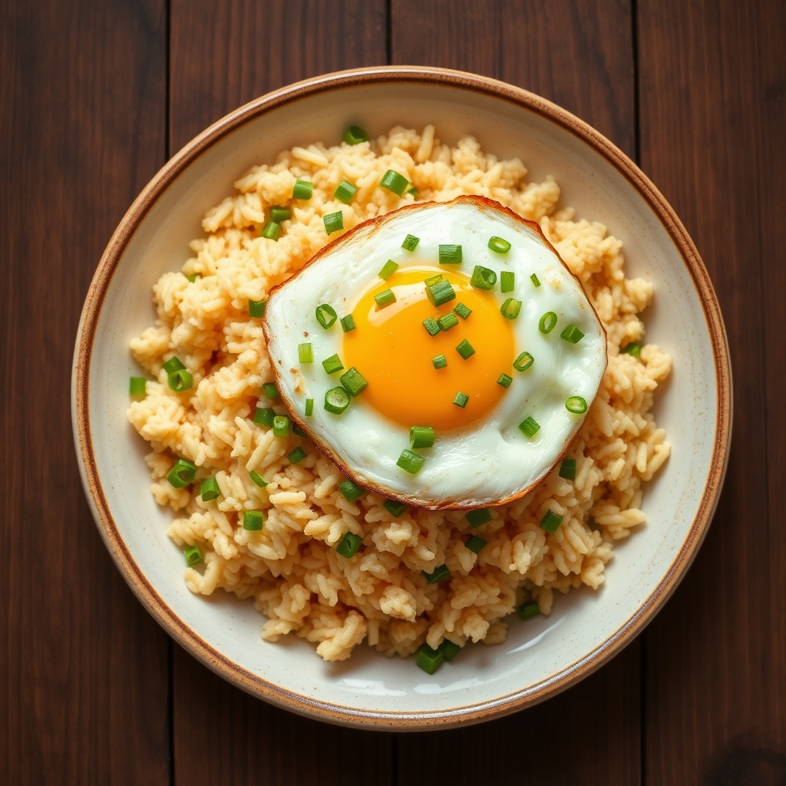

# 초간단 계란볶음밥

> ⏱️ 조리시간: 10분 | 🍽️ 1인분 | 난이도: ⭐ 쉬움

## 📝 재료
- 찬밥(또는 즉석밥) — 1공기
- 계란 — 2개
- 대파 — 1/4대 (없으면 쪽파나 양파 조금)
- 간장 — 1큰술
- 식용유 — 1큰술
- 참기름 — 1/2작은술
- 소금·후추 — 약간
- (선택) 김가루·깨 — 약간

## 👨‍🍳 만드는 법
1. 대파를 잘게 송송 썰어요.
2. 팬에 식용유를 두르고 중불로 달군 뒤, 대파를 넣고 30초 정도 볶아 파기름을 내요.
3. 계란 2개를 깨서 넣고 젓가락으로 휘휘 저어 반쯤 익혀요.
4. 찬밥을 넣고 주걱으로 눌러가며 계란과 골고루 섞어 볶아요.
5. 간장 1큰술을 팬 가장자리에 둘러 살짝 태우듯 넣고, 소금·후추로 간해요.
6. 불을 끄고 참기름을 살짝 둘러 마무리! 그릇에 담고 김가루·깨를 뿌리면 끝이에요.

## 💡 꿀팁
- 밥은 갓 지은 밥보다 **찬밥**이 훨씬 고슬고슬하게 볶여요. 즉석밥이면 살짝만 데워서 쓰세요.
- **팬 하나면 끝!** 계란을 따로 부치지 않고 같은 팬에서 스크램블하듯 익히면 설거지가 거의 안 나와요.
- 간장 대신 **굴소스 1작은술**을 넣으면 감칠맛이 확 올라가요. 대파가 없으면 양파·냉장고 속 아무 채소나 잘게 썰어 넣어도 좋아요.
