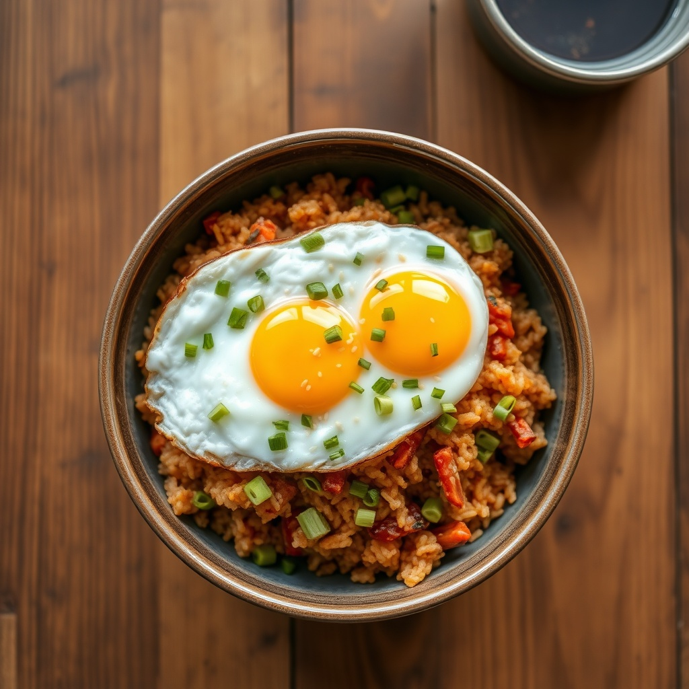

# 계란 김치볶음밥

> ⏱️ 조리시간: 10분 | 🍽️ 1인분 | 난이도: ⭐ 쉬움

## 📝 재료
- 찬밥 — 1공기 (약 200g)
- 김치 — 1컵 (약 150g, 잘게 썬 것)
- 계란 — 2개
- 다진 마늘 — 1/2큰술
- 식용유 — 1큰술
- 참기름 — 1작은술
- (선택) 김치 국물 — 1~2큰술
- (선택) 설탕 — 약간

## 👨‍🍳 만드는 법
1. 김치를 먹기 좋게 잘게 썹니다. 신 김치일수록 볶으면 더 맛있어요.
2. 달군 팬에 식용유 1큰술을 두르고 다진 마늘과 김치를 넣어 2~3분간 볶습니다. 김치가 나른해지고 가장자리가 노릇해질 때까지 볶으면 감칠맛이 확 올라와요.
3. 찬밥을 넣고 김치 국물 1~2큰술을 함께 넣어 밥알이 뭉치지 않게 주걱으로 눌러가며 3~4분 볶습니다. (밥이 딱딱하면 물 1큰술 추가)
4. 간을 보고 싱거우면 김치 국물이나 소금으로 맞추고, 참기름 1작은술을 둘러 향을 냅니다. 완성된 볶음밥은 그릇에 담아둡니다.
5. 같은 팬을 살짝 닦고 기름을 조금 둘러 계란 프라이 2개를 반숙으로 부칩니다.
6. 볶음밥 위에 계란 프라이를 올리면 완성! 노른자를 터뜨려 비벼 드세요.

## 💡 꿀팁
- 밥은 갓 지은 밥보다 **찬밥**이 훨씬 좋아요. 수분이 적어 고슬고슬하게 볶아집니다. (지금처럼 찬밥이 딱이에요!)
- 볶음밥을 한 팬에서 다 만들고 **같은 팬에 계란까지 부치면** 설거지는 팬 하나로 끝! 물로 살짝 헹구고 바로 부치면 됩니다.
- 김치가 덜 익었으면 설탕 약간을 넣어 볶으면 감칠맛이 살아나요. 반대로 너무 시면 설탕을 조금 더 넣어 균형을 맞추세요.
- 계란이 부담스러우면 스크램블로 밥과 함께 볶아도 되고, 프라이 대신 밥 볶을 때 넣어 섞어도 맛있어요.
- 참기름 대신 들기름을 써도 향이 좋고, 마지막에 김가루나 깨를 뿌리면 더 근사해집니다.
