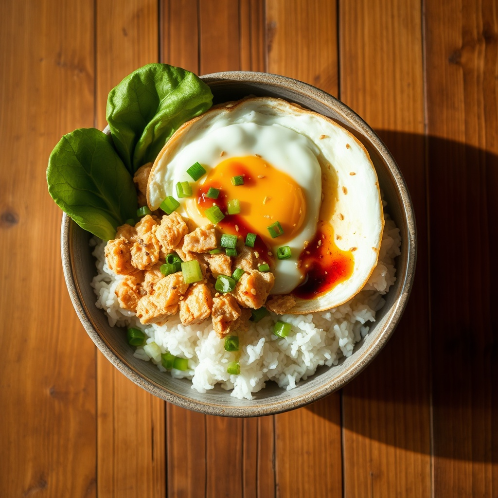

# 참치마요 덮밥

> ⏱️ 조리시간: 7분 | 🍽️ 1인분 | 난이도: ⭐ 쉬움

설거지 최소! 밥그릇 하나에 다 담아 그대로 먹는 한 그릇 저녁이에요. 참치캔 하나면 충분합니다. 😊

## 📝 재료
- 참치캔 — 1개 (小, 100g 내외)
- 따뜻한 밥 — 1공기 (즉석밥도 OK)
- 마요네즈 — 1.5큰술
- 간장 — 1작은술
- 설탕 — 약간 (½작은술, 생략 가능)
- 참기름 — ½작은술
- 대파 or 쪽파 — 약간 (있으면, 없으면 생략)
- 통깨 — 약간 (선택)
- 계란 — 1개 (있으면 프라이 올려도 좋아요, 선택)

## 👨‍🍳 만드는 법
1. 참치캔의 뚜껑을 살짝 열어 캔째로 기름(물)을 꾹 눌러 따라 버립니다. (기름을 빼야 느끼하지 않아요.)
2. 밥그릇에 따뜻한 밥을 담습니다. 즉석밥이면 봉지째 데운 뒤 그릇에 붓습니다.
3. 밥 위에 기름 뺀 참치를 올리고, 마요네즈·간장·설탕·참기름을 넣습니다.
4. 숟가락으로 쓱쓱 비비듯 섞습니다. (그릇 안에서 바로 비벼요.)
5. 파와 통깨를 살짝 뿌려 마무리. 계란프라이가 있으면 위에 올려주면 더 든든해요!

## 💡 꿀팁
- **설거지 최소화**: 참치 기름은 캔째로 따라 버려 체·거름망이 필요 없고, 밥그릇 하나에서 비벼 그대로 먹으면 도마·프라이팬 없이 끝나요. 캔은 헹궈서 분리배출!
- 간장 대신 **쯔유·굴소스**를 넣어도 감칠맛이 확 살아요.
- 매콤하게 먹고 싶으면 **스리라차나 고추장 ½작은술**을 추가하세요.
- 밥이 없으면 **식빵에 올려 참치마요 토스트**로, 김이 있으면 **김에 싸 먹어도** 맛있어요.
- 마요네즈가 없으면 참치 + 간장 + 참기름만으로도 든든한 참치비빔밥이 됩니다.
