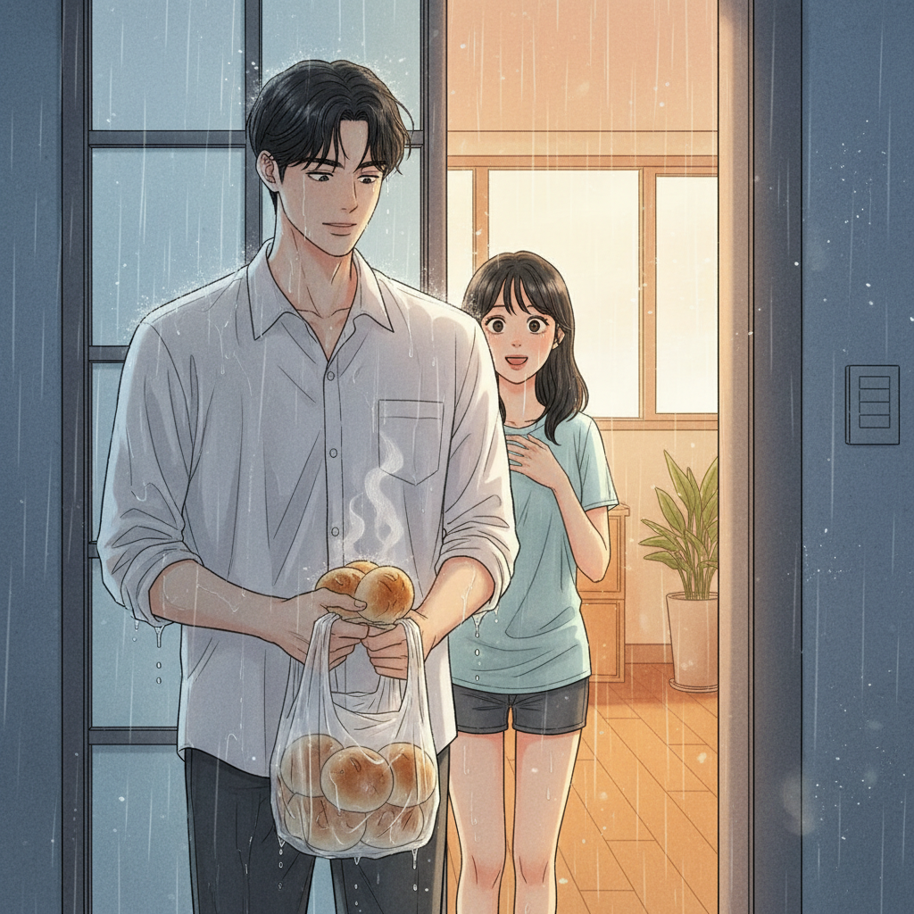

# 비 오는 날의 약속

― 2026년 5월 30일의 일기를 로맨스 소설로 각색

## 1.

아침부터 하늘이 무겁게 가라앉아 있었다.

서연은 커튼을 걷다 말고 창밖을 한참 바라보았다. 오늘은 그와 만나기로 한 날이었다. 정확히는 '친구'라고 불러야 할 사이였지만, 서연은 며칠 전부터 그 단어가 자꾸 입안에서 어색하게 굴러다니는 걸 느끼고 있었다.

준호. 대학 때부터 알고 지낸, 늘 곁에 있어서 오히려 한 번도 제대로 들여다본 적 없던 사람.

옷장 앞에서 세 번이나 옷을 갈아입었다. 친구를 만나는 데 이렇게 고민할 일인가, 스스로에게 핀잔을 주면서도 손은 자꾸 가장 좋아하는 연파란색 셔츠로 향했다.

## 2.

그때 휴대폰이 울렸다.

**준호:** 서연아, 미안. 비가 너무 많이 와서… 오늘 약속 미루는 게 어때?

창밖을 보니 어느새 빗줄기가 유리를 두드리고 있었다. 회색 도시 위로 빗물이 사선을 그으며 떨어졌다.

"…그래. 다음에 보자."

짧게 답장을 보내고 휴대폰을 내려놓았다. 이상하게도 가슴 한구석이 텅 빈 것 같았다. 고작 약속 하나 취소됐을 뿐인데. 서연은 침대에 풀썩 누웠다. 천장을 바라보며, 자신이 생각보다 이 만남을 기다리고 있었다는 사실을 그제야 깨달았다.

빗소리를 들으며 스르르 잠이 들었다.

## 3.

얼마나 지났을까. 초인종 소리에 눈을 떴다.

문을 열자, 흠뻑 젖은 준호가 우산도 없이 서 있었다. 손에는 비닐봉지에 싸인 무언가가 들려 있었다.

"비 와서 약속은 취소했는데," 그가 머쓱하게 웃었다. "그냥… 네가 좋아하는 호빵 사 왔어. 비 오는 날엔 이게 최고잖아."

서연은 말문이 막혔다. 빗물이 그의 머리카락 끝에서 뚝뚝 떨어지고 있었다.

"바보야, 그러다 감기 걸려."

수건을 가지러 가는 척 돌아섰지만, 서연의 얼굴엔 어느새 미소가 번지고 있었다. 취소된 줄 알았던 하루가, 사실은 이제 막 시작되고 있었다.

밖에는 여전히 비가 내렸다. 그러나 그 빗소리가, 오늘만큼은 조금도 쓸쓸하게 들리지 않았다.

*― 끝*
