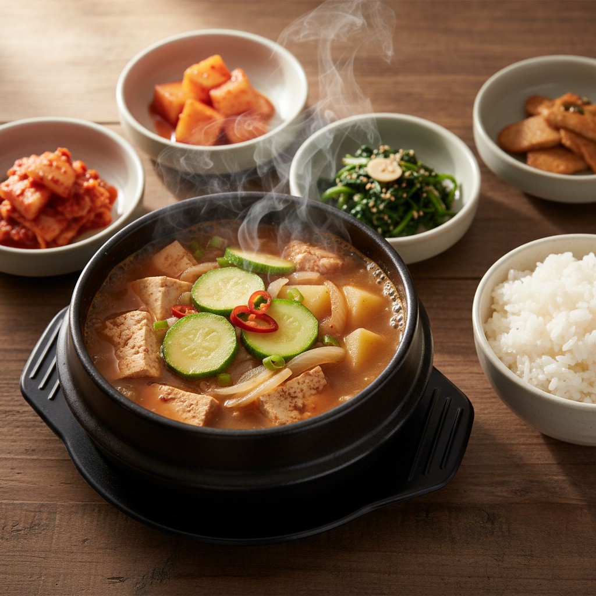

# 된장찌개

간단하게 끓일 수 있는 한국식 저녁 메뉴입니다. 약 20분 소요, 2인분 기준.

## 재료

- 된장 2큰술
- 두부 1/2모
- 애호박 1/4개
- 양파 1/2개
- 감자 1개 (작은 것)
- 대파 1/2대
- 청양고추 1개 (선택)
- 다진 마늘 1작은술
- 멸치 다시마 육수 (또는 물) 500ml

## 만드는 법

1. 냄비에 육수 500ml를 붓고 된장 2큰술을 풀어 끓입니다.
2. 감자, 양파를 한입 크기로 썰어 먼저 넣고 5분간 끓입니다.
3. 애호박과 두부를 넣고 다진 마늘을 추가합니다.
4. 중불에서 5~7분 더 끓입니다.
5. 마지막에 대파와 청양고추를 넣고 1분 더 끓이면 완성입니다.

## 팁

- 더 깊은 맛을 원하면 고춧가루 1작은술을 추가하세요.
- 바지락이나 소고기를 넣으면 감칠맛이 좋아집니다.
- 갓 지은 밥과 함께 드세요.
